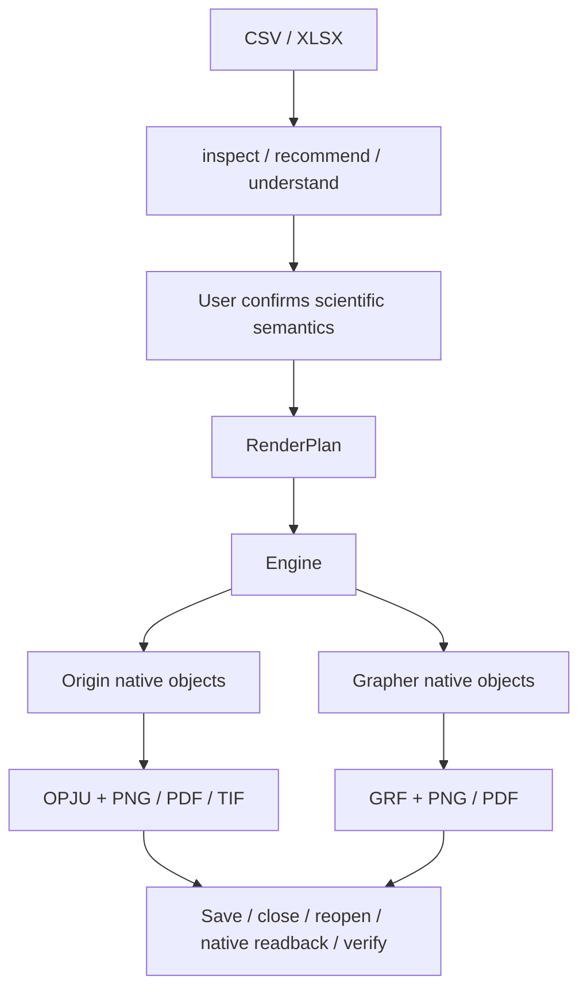

# FigureLoom

**Scientific tables → editable native Origin / Grapher projects.**

[中文](README.md) · [Quickstart](docs/quickstart.md) · [Capabilities and limits](docs/release-v0.2.md)

FigureLoom is a local Windows workflow available through a CLI, Python API and Codex Skill.
It inspects the input, asks users to confirm scientific column roles, error meanings and fit choices,
then creates native objects in the selected plotting application. Outputs include an editable project,
exports, a frozen RenderPlan and verification records.

Current version: **0.2.1**. Validated environments use physical Windows 10/11 x64,
Python 3.10–3.12, OriginPro 2024 and Golden Software Grapher 27.
Install and license the application selected for rendering yourself.

v0.2.1 hotfix: `pywin32` is a direct Grapher COM dependency. Grapher 27 is
single-instance: if a user window is open, FigureLoom attaches to that Application,
creates its own document and does not quit the user's instance. An explicit Origin
or Grapher request is a hard constraint; failure never silently switches backends.
Only `auto` may choose by policy (currently Origin). See the
[v0.2.1 release notes](docs/release-v0.2.1.md) for validation and limitations.

## Workflow



Open OPJU or GRF in its application to edit native series, axes and supported fits.
Keep Grapher staging CSV files with the GRF. Python may perform explicitly authorized
statistical preparation; final figures are created by Origin or Grapher.

## Backend capabilities

| Capability | Origin | Grapher |
| --- | --- | --- |
| Scatter, Line, multiple series, symmetric Y error bars, Bar family | Supported | Supported |
| Verified CV / LSV / XAS routes | Supported | Supported |
| Native Linear Fit, partial X range, independent multi-series Linear Fit | Supported | Supported |
| Native Quadratic Fit | Supported | Supported |
| Explicit per-point direct-weight Linear Fit | Supported; W is independent of plotted errors | Unsupported; unsupported_fit_weighting |
| Correlation Heatmap | Native Matrix Heatmap, continuous color scale | Native Class Scatter, 21 discrete color intervals |
| Other inherited scientific routes | 41 public Origin routes; see coverage | 7 of the inherited Origin routes; no general parity claim |
| Session edits | X/Y axis titles | X/Y axis titles, named-series solid/dashed line style |

See [route coverage](docs/route-coverage-phase13.md), [Fit capabilities](docs/fit-phase10.md)
and [release boundaries](docs/release-v0.2.md). Unsupported requests fail explicitly.
ErrorBar semantics and Fit weighting are independent: SD or SEM columns do not automatically enable weighting.

## Run an example

From the repository root in PowerShell:

```powershell
py -3.12 -m venv .venv
.\.venv\Scripts\python.exe -m pip install -c requirements-runtime.lock -e .\runtime
.\.venv\Scripts\python.exe skill\figureloom\scripts\figureloom.py --version
.\.venv\Scripts\python.exe skill\figureloom\scripts\figureloom.py doctor --engine grapher --live --human
.\.venv\Scripts\python.exe skill\figureloom\scripts\figureloom.py workflow-preview docs\quickstart-data\multiseries.csv --engine grapher --template-id trend --output-dir runs\grapher-01 --engine-home runtime
```

Review column mappings and the confirmation gate in `runs\grapher-01\workflow-preview.json`, then run:

```powershell
.\.venv\Scripts\python.exe skill\figureloom\scripts\figureloom.py workflow-render runs\grapher-01\workflow-preview.json --claim "Compare Control and Treatment" --confirm --human
```

Open the generated `result.grf` in Grapher. Follow [Quickstart](docs/quickstart.md)
for Origin, XLSX, session edits and correlation examples. Use a new output directory for each run.
For Codex Skill installation, see [installation](docs/installation.md).

## Correlation Heatmap

Accepts square symmetric correlation matrices with optional explicitly supplied p-value matrices.
Raw-observation Pearson coefficients and two-sided p-values require a separate explicit preparation step.
There is no p-value inference from coefficients or multiple-comparison correction.

Color meaning stays within −1 to +1. Labels, values and significance markers remain native editable objects.
Origin uses a continuous scale; Grapher uses a native 21-class mapping shared with its legend.
Adaptive physical layout enlarges cells and pages for long labels. Origin Whole Page changes the viewport only.
Recommended size is at most 10×10; the hard limit is 20×20. Keep `correlation_cells.csv` with the GRF.
See [validation evidence](docs/correlation-heatmap-phase17.md).

## Operating boundaries

- Source data remain read only. Scientific roles, errors, fits and derived calculations require explicit confirmation.
- A reference image can suggest styling. Confirmed choices are capability-gated: applied, template default retained, or rejected.
- Verification checks files, reopening and native readback. Inspect the native GUI at the intended physical size before publication.
- Grapher reuses an existing user window without quitting it; otherwise it launches and owns a server and quits after completion. Long-lived single-process batches still have documented COM limitations.
- Unknown Origin processes are never killed. Application lifecycle limits remain documented in release notes.
- Full native automation is not supported on macOS, Linux, WSL or virtual machines.
- Codex Skill needs scoped access to selected-data, project and output folders. Ordinary use does not require administrator access,
  registry or DCOM changes. Allow mouse/GUI interaction separately when needed.
- The local runtime does not initiate data uploads. Codex host/account policies apply separately; automatic PHI detection is not provided.
  See [privacy](PRIVACY.md).

## Origin of the project

FigureLoom continues development from [EditaPlot by hang-jin](https://github.com/hang-jin/editaplot).
It retains the scientific semantics workflow and Origin runtime, and adds the Engine boundary,
Grapher backend, dual-backend Fit work, session editing and Correlation Heatmap.
Backend capabilities are explicitly different. Original attribution is retained in [AUTHORS](AUTHORS.md)
and Git history. The current repository is maintained by [yuxian-cell](https://github.com/yuxian-cell).

[Apache-2.0](LICENSE) · [NOTICE](NOTICE) · [Contributing](CONTRIBUTING.md) ·
[Support](SUPPORT.md) · [Security](SECURITY.md).
FigureLoom is not affiliated with OriginLab or Golden Software.
