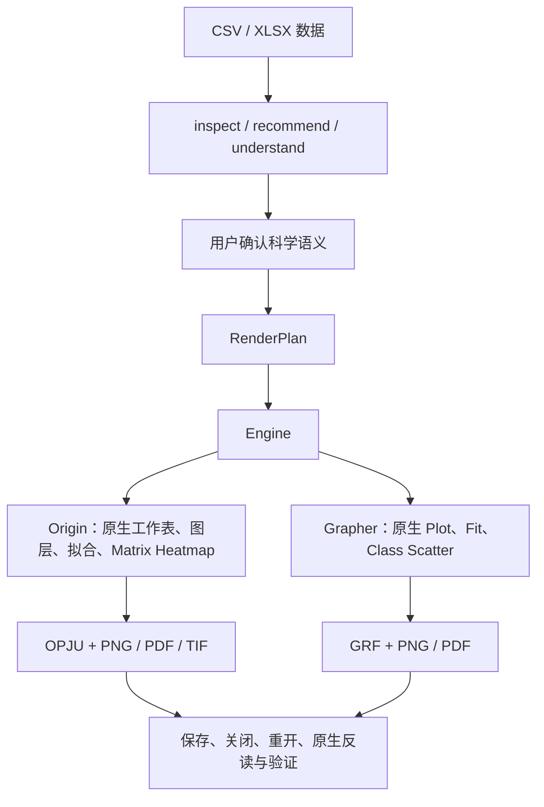

# FigureLoom

**把科研表格转成可继续编辑的 Origin / Grapher 原生项目。**

[English](README.en.md) · [快速开始](docs/quickstart.md) · [能力与限制](docs/release-v0.2.md)

FigureLoom 是 Windows 本地科研绘图工作流，可通过 CLI、Python API 或 Codex Skill 使用。
先检查数据和列语义，由用户确认图形、误差及拟合含义，再由所选软件创建原生对象。
结果包含可编辑项目、导出图片、冻结的 RenderPlan 和验证记录。

当前版本：**0.2.0**。已验证环境为实体 Windows 10/11 x64、Python 3.10–3.12、
OriginPro 2024 与 Golden Software Grapher 27。使用哪个后端，就需要自行安装并许可对应软件。

## 从数据到原生项目



打开 OPJU 或 GRF 后，仍可在对应软件中编辑系列、坐标轴和已支持的原生拟合。
Grapher 项目依赖的 staging CSV 应与 GRF 一起保留。
Python 可以用于明确授权的数据准备；最终图由 Origin / Grapher 创建，预览图不作为原生结果。

## 两个后端支持什么

| 能力 | Origin | Grapher |
| --- | --- | --- |
| Scatter、Line、多系列、对称 Y ErrorBar、Bar family | 支持 | 支持 |
| CV / LSV / XAS 已验证路线 | 支持 | 支持 |
| 原生 Linear Fit、部分 X 范围、独立多系列 Linear Fit | 支持 | 支持 |
| 原生 Quadratic Fit | 支持 | 支持 |
| 显式逐点 direct-weight Linear Fit | 支持；W 与图上误差列独立 | 不支持，返回 unsupported_fit_weighting |
| Correlation Heatmap | Matrix Heatmap，原生连续色阶 | Class Scatter，21 个离散颜色区间 |
| 其他材料、分布、医学等既有路线 | 41 条公开 Origin 路线，见覆盖文档 | 既有 Origin 路线中的 7 条；不表示全部图类型通用支持 |
| 编辑会话 | X/Y 轴标题 | X/Y 轴标题、命名系列实线/虚线 |

[路线覆盖](docs/route-coverage-phase13.md) · [Fit 能力](docs/fit-phase10.md) ·
[完整版本边界](docs/release-v0.2.md)。不支持的请求会明确报错，不自动替换为另一种科学含义。
ErrorBar 列和 Fit 权重列是独立语义；存在 SD 或 SEM 不会自动启用加权拟合。

## 先跑一个示例

在仓库根目录打开 PowerShell：

```powershell
py -3.12 -m venv .venv
.\.venv\Scripts\python.exe -m pip install -e .\runtime pywin32
.\.venv\Scripts\python.exe skill\figureloom\scripts\figureloom.py --version
.\.venv\Scripts\python.exe skill\figureloom\scripts\figureloom.py doctor --engine grapher --live --human
.\.venv\Scripts\python.exe skill\figureloom\scripts\figureloom.py workflow-preview docs\quickstart-data\multiseries.csv --engine grapher --template-id trend --output-dir runs\grapher-01 --engine-home runtime
```

检查 `runs\grapher-01\workflow-preview.json` 的列映射和确认门禁，再执行：

```powershell
.\.venv\Scripts\python.exe skill\figureloom\scripts\figureloom.py workflow-render runs\grapher-01\workflow-preview.json --claim "Compare Control and Treatment" --confirm --human
```

在 Grapher 中打开生成的 `result.grf`。测试 Origin、XLSX、会话编辑或 Correlation Heatmap，
请使用 [完整 Quickstart](docs/quickstart.md) 中对应的命令。每次测试选择新的输出目录。

使用 Codex Skill 时，可参考 [安装指南](docs/installation.md)，并明确指定后端：

> 用 FigureLoom 检查这份 CSV，先说明列用途和误差含义，推荐图形让我确认。
> 确认后用 Grapher 生成可编辑 GRF、PNG、PDF，并报告重开验证结果。

## Correlation Heatmap

支持方形对称相关矩阵，以及用户明确提供的 p-value 矩阵。
原始观测的 Pearson 相关系数与双侧 p-value 需要先执行明确的数据准备步骤；
不从相关系数猜 p-value，不做多重比较校正。

色义固定为 −1 到 +1；标签、数值和显著性标记为原生可编辑对象。
Origin 使用连续色阶，Grapher 使用原生 21-class mapping 与共享图例。
长标签和注释通过增大实际页面与单元格处理；Origin Whole Page 仅调整视口。
推荐不超过 10×10，硬上限 20×20。保留 Grapher 的 `correlation_cells.csv`。
详见 [Correlation Heatmap 验证记录](docs/correlation-heatmap-phase17.md)。

## 使用边界

- 原始数据只读；列用途、误差定义、拟合及派生计算需要明确确认。
- 参考图可辅助选择样式；明确选择优先，线宽、填充透明度、画幅比例、图例显示/无框/位置受当前 renderer 能力限制。
- 验证包括产物、重开和原生反读；发布前仍应在原生 GUI 检查实际尺寸下的图形。
- Grapher COM 每个任务使用隔离实例；同一长期运行进程的连续批量任务存在已记录的 COM 限制。
- 不关闭或 kill 无法证明归属的 Origin 用户进程；生命周期限制见发布说明。
- 当前不提供 macOS、Linux、WSL 或虚拟机上的完整原生自动化支持。
- Codex Skill 只需要所选数据、项目和输出目录的权限；普通使用不要求管理员、修改注册表或 DCOM。需要鼠标 GUI 检查时应单独允许。
- 本地 runtime 不会主动把你的数据上传到网络；Codex 宿主另受账户与组织策略约束，不承诺自动发现 PHI。见 [隐私说明](PRIVACY.md)。

## 项目来源与维护

FigureLoom 基于 [hang-jin 的 EditaPlot](https://github.com/hang-jin/editaplot) 继续开发。
继承其科研语义流程与 Origin runtime，并加入 Engine 边界、Grapher 后端、双后端 Fit、
会话编辑和 Correlation Heatmap。它不是两个后端能力完全等价的声明。
原作者与贡献记录见 [AUTHORS](AUTHORS.md) 和 Git 历史；当前仓库由
[yuxian-cell](https://github.com/yuxian-cell) 维护。

许可证：[Apache-2.0](LICENSE) · [NOTICE](NOTICE) · [贡献](CONTRIBUTING.md) ·
[问题与支持](SUPPORT.md) · [安全](SECURITY.md)。项目与 OriginLab 或 Golden Software 无官方隶属关系。
